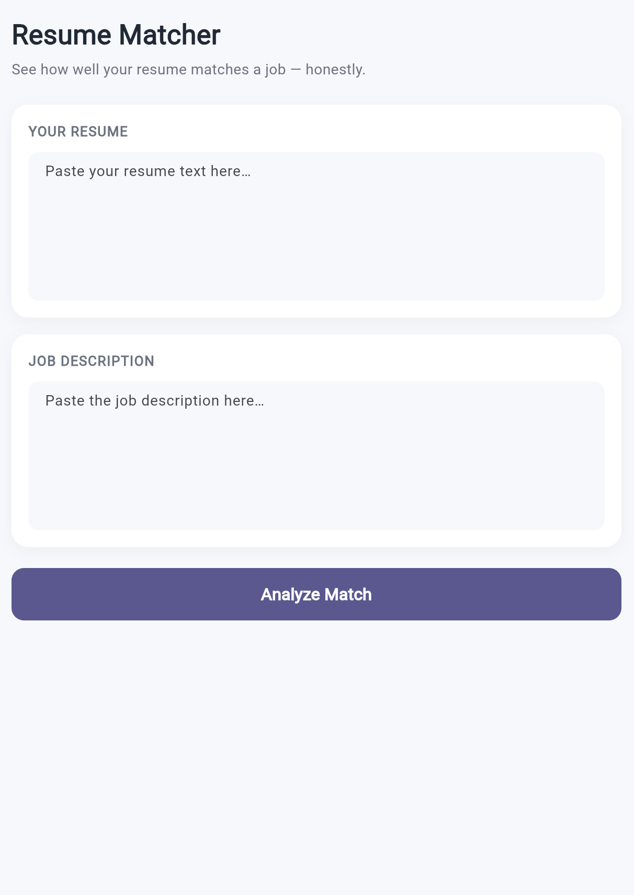
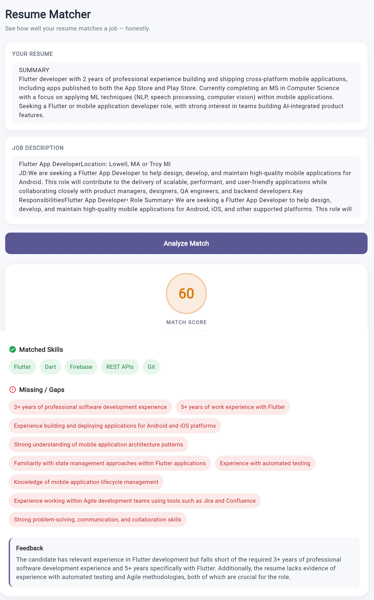

# Resume ↔ Job Description Matcher

A Flutter app that compares a resume against a job description and returns an honest match score, matched skills, missing skills/gaps, and specific improvement feedback — powered by the OpenAI API.

Built this to solve a real problem in my own job search: quickly checking how well my resume aligns with a specific posting, and where the actual gaps are, before applying.




## Features

- Paste in any resume and job description as plain text
- Get a 0–100 match score (calibrated to be realistic, not inflated — most resumes score well below 100 even when qualified)
- See matched skills vs. specific missing skills/requirements
- Get short, actionable feedback on how to close the gap

## How it works

The app sends the resume and job description to OpenAI's API (`gpt-4o-mini`) with a carefully constrained prompt that:
- Instructs the model to act as a strict, realistic recruiter rather than a generic assistant
- Forces it to surface real gaps rather than defaulting to an inflated "everything matches" response
- Requires structured JSON output, which the app parses directly into the UI

## Tech Stack

- **Flutter / Dart** — UI and app logic
- **OpenAI API** (`gpt-4o-mini`) — resume/JD analysis
- **flutter_dotenv** — local API key management (not committed to the repo)
- **http** — API networking

## Running it locally

1. Clone the repo
2. Run `flutter pub get`
3. Create a `.env` file in the project root:
   ```
   OPENAI_API_KEY=your-key-here
   ```
4. Run `flutter run`

## What I'd add next

- Support for uploading resume/JD as PDF instead of pasting text
- Save/compare match history across multiple job applications
- On-device caching so repeated comparisons don't re-call the API unnecessarily

## Why I built this

I'm a Flutter developer with professional experience building and shipping cross-platform apps (published to both the App Store and Play Store), currently exploring how to integrate practical AI features into mobile applications. This project was a way to combine both — a real Flutter app, with a genuinely useful AI layer, solving a problem I actually have.
